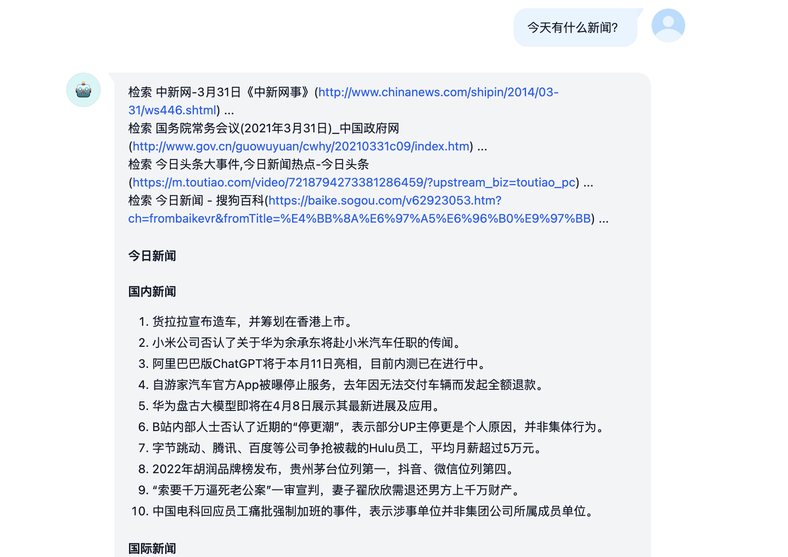
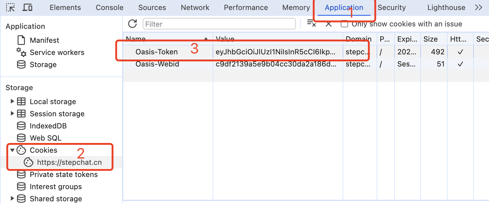

# 跃问StepChat Free 服务


支持高速流式输出、支持多轮对话、支持联网搜索、支持长文档解读、支持图像解析（正在开发），零配置部署，多路token支持，自动清理会话痕迹。

与ChatGPT接口完全兼容。

还有以下四个free-api欢迎关注：

Moonshot AI（Kimi.ai）接口转API [kimi-free-api](https://github.com/LLM-Red-Team/kimi-free-api)

阿里通义 (Qwen) 接口转API [qwen-free-api](https://github.com/LLM-Red-Team/qwen-free-api)

ZhipuAI (智谱清言) 接口转API [glm-free-api](https://github.com/LLM-Red-Team/glm-free-api)

聆心智能 (Emohaa) 接口转API [emohaa-free-api](https://github.com/LLM-Red-Team/emohaa-free-api)

## 目录

* [声明](#声明)
* [在线体验](#在线体验)
* [效果示例](#效果示例)
* [接入准备](#接入准备)
  * [多账号接入](#多账号接入)
* [Docker部署](#Docker部署)
  * [Docker-compose部署](#Docker-compose部署)
* [原生部署](#原生部署)
* [接口列表](#接口列表)
  * [对话补全](#对话补全)
  * [文档解读](#文档解读)
  * [图像解析](#图像解析)
* [注意事项](#注意事项)
  * [Nginx反代优化](#Nginx反代优化)

## 声明

仅限自用，禁止对外提供服务或商用，避免对官方造成服务压力，否则风险自担！

仅限自用，禁止对外提供服务或商用，避免对官方造成服务压力，否则风险自担！

仅限自用，禁止对外提供服务或商用，避免对官方造成服务压力，否则风险自担！

## 在线体验

此链接仅临时测试功能，不可长期使用，长期使用请自行部署。

https://udify.app/chat/RGqDVPHspgQgGSgf

## 效果示例

### 验明正身


### 多轮对话


### 联网搜索



### 长文档解读


### 图像解析

功能开发中...

## 接入准备

从 [stepchat.cn](https://stepchat.cn) 获取Oasis-Token

进入StepChat随便发起一个对话，然后F12打开开发者工具，从Application > Cookies中找到`Oasis-Token`的值，这将作为Authorization的Bearer Token值：`Authorization: Bearer TOKEN`



### 多账号接入

你可以通过提供多个账号的refresh_token并使用`,`拼接提供：

`Authorization: Bearer TOKEN1,TOKEN2,TOKEN3`

每次请求服务会从中挑选一个。

## Docker部署

请准备一台具有公网IP的服务器并将8000端口开放。

拉取镜像并启动服务

```shell
docker run -it -d --init --name step-free-api -p 8000:8000 -e TZ=Asia/Shanghai vinlic/step-free-api:latest
```

查看服务实时日志

```shell
docker logs -f step-free-api
```

重启服务

```shell
docker restart step-free-api
```

停止服务

```shell
docker stop step-free-api
```

### Docker-compose部署

```yaml
version: '3'

services:
  step-free-api:
    container_name: step-free-api
    image: vinlic/step-free-api:latest
    restart: always
    ports:
      - "8000:8000"
    environment:
      - TZ=Asia/Shanghai
```

## 原生部署

请准备一台具有公网IP的服务器并将8000端口开放。

请先安装好Node.js环境并且配置好环境变量，确认node命令可用。

安装依赖

```shell
npm i
```

安装PM2进行进程守护

```shell
npm i -g pm2
```

编译构建，看到dist目录就是构建完成

```shell
npm run build
```

启动服务

```shell
pm2 start dist/index.js --name "step-free-api"
```

查看服务实时日志

```shell
pm2 logs step-free-api
```

重启服务

```shell
pm2 reload step-free-api
```

停止服务

```shell
pm2 stop step-free-api
```

## 接口列表

目前支持与openai兼容的 `/v1/chat/completions` 接口，可自行使用与openai或其他兼容的客户端接入接口，或者使用 [dify](https://dify.ai/) 等线上服务接入使用。

### 对话补全

对话补全接口，与openai的 [chat-completions-api](https://platform.openai.com/docs/guides/text-generation/chat-completions-api) 兼容。

**POST /v1/chat/completions**

header 需要设置 Authorization 头部：

```
Authorization: Bearer [refresh_token]
```

请求数据：
```json
{
    // 模型名称随意填写
    "model": "step",
    "messages": [
        {
            "role": "user",
            "content": "你是谁？"
        }
    ],
    // 如果使用SSE流请设置为true，默认false
    "stream": false
}
```

响应数据：
```json
{
    "id": "85466015488159744",
    "model": "step",
    "object": "chat.completion",
    "choices": [
        {
            "index": 0,
            "message": {
                "role": "assistant",
                "content": "我是跃问(StepChat)，一个由阶跃星辰(StepFun)开发的多模态大模型。我可以回答您的问题，提供信息和帮助，同时支持多种模态的交互，如文字、图像等。如果您有任何问题或需要帮助，请随时向我提问。"
            },
            "finish_reason": "stop"
        }
    ],
    "usage": {
        "prompt_tokens": 1,
        "completion_tokens": 1,
        "total_tokens": 2
    },
    "created": 1711829974
}
```

### 文档解读

提供一个可访问的文件URL或者BASE64_URL进行解析。

**POST /v1/chat/completions**

header 需要设置 Authorization 头部：

```
Authorization: Bearer [refresh_token]
```

请求数据：
```json
{
    // 模型名称随意填写，如果不希望输出检索过程模型名称请包含silent_search
    "model": "kimi",
    "messages": [
        {
            "role": "user",
            "content": [
                {
                    "type": "file",
                    "file_url": {
                        "url": "https://mj101-1317487292.cos.ap-shanghai.myqcloud.com/ai/test.pdf"
                    }
                },
                {
                    "type": "text",
                    "text": "文档里说了什么？"
                }
            ]
        }
    ]
}
```

响应数据：
```json
{
    "id": "85774360661086208",
    "model": "step",
    "object": "chat.completion",
    "choices": [
        {
            "index": 0,
            "message": {
                "role": "assistant",
                "content": "这是一个关于爱情魔法的文档。它包含了四个部分：\n\n1. **PMG 4.1390 – 1495**：这是一个使用面包和咒语来吸引心仪女性的仪式。仪式中需要将面包分成七个小块，并在特定地点进行咒语的念诵和投掷。\n2. **PMG 4.1342 – 57**：这是一个召唤恶魔来使一个名叫Tereous的女性受到折磨，直到她与一个名叫Didymos的人相爱并结合的咒语。\n3. **PGM 4.1265 – 74**：这是关于如何赢得一个美丽的女人的咒语。它涉及到连续三天保持纯洁，向女神阿佛洛狄特（Aphrodite）供奉乳香，并在心中默念她的神秘名字。\n4. **PGM 4.1496 – 1**：这是一个使用没药来吸引一个特定女性的咒语。这个咒语需要在煤上焚烧没药的同时念诵，目的是让这个女性心中只想着施咒者，并最终与施咒者相爱。"
            },
            "finish_reason": "stop"
        }
    ],
    "usage": {
        "prompt_tokens": 1,
        "completion_tokens": 1,
        "total_tokens": 2
    },
    "created": 1711903489
}
```

### 图像解析

提供一个可访问的图像URL或者BASE64_URL进行解析。

此格式兼容 [gpt-4-vision-preview](https://platform.openai.com/docs/guides/vision) API格式，您也可以用这个格式传送文档进行解析。

**POST /v1/chat/completions**

header 需要设置 Authorization 头部：

```
Authorization: Bearer [refresh_token]
```

请求数据：
```json
{
    // 模型名称随意填写
    "model": "step",
    "messages": [
        {
            "role": "user",
            "content": [
                {
                    "type": "image_url",
                    "image_url": {
                        "url": "https://k.sinaimg.cn/n/sinakd20111/106/w1024h682/20240327/babd-2ce15fdcfbd6ddbdc5ab588c29b3d3d9.jpg/w700d1q75cms.jpg"
                    }
                },
                {
                    "type": "text",
                    "text": "图像描述了什么？"
                }
            ]
        }
    ]
}
```

响应数据：
```json
{
    "id": "85773574417829888",
    "model": "step",
    "object": "chat.completion",
    "choices": [
        {
        "index": 0,
        "message": {
            "role": "assistant",
            "content": "这张图片展示了一个活动现场，似乎是某种新产品或技术的发布会。图片中央有一个大屏幕，上面写着“创新技术及产品首发”，屏幕上还展示了一些公司的标志或名称，如“RWKV”、“财跃星辰”、“阶跃星辰”、“商汤”和“零方科技”。在屏幕下方的舞台上，有几位穿着正装的人士正在进行互动，可能是在进行产品发布或演示。整个场景给人一种正式且科技感十足的印象。"
        },
        "finish_reason": "stop"
        }
    ],
    "usage": {
        "prompt_tokens": 1,
        "completion_tokens": 1,
        "total_tokens": 2
    },
    "created": 1711903302
}
```

## 注意事项

### Nginx反代优化

如果您正在使用Nginx反向代理step-free-api，请添加以下配置项优化流的输出效果，优化体验感。

```nginx
# 关闭代理缓冲。当设置为off时，Nginx会立即将客户端请求发送到后端服务器，并立即将从后端服务器接收到的响应发送回客户端。
proxy_buffering off;
# 启用分块传输编码。分块传输编码允许服务器为动态生成的内容分块发送数据，而不需要预先知道内容的大小。
chunked_transfer_encoding on;
# 开启TCP_NOPUSH，这告诉Nginx在数据包发送到客户端之前，尽可能地发送数据。这通常在sendfile使用时配合使用，可以提高网络效率。
tcp_nopush on;
# 开启TCP_NODELAY，这告诉Nginx不延迟发送数据，立即发送小数据包。在某些情况下，这可以减少网络的延迟。
tcp_nodelay on;
# 设置保持连接的超时时间，这里设置为120秒。如果在这段时间内，客户端和服务器之间没有进一步的通信，连接将被关闭。
keepalive_timeout 120;
```

### Token统计

由于推理侧不在step-free-api，因此token不可统计，将以固定数字返回!!!!!

## Star History

[](https://star-history.com/#LLM-Red-Team/step-free-api&Date)